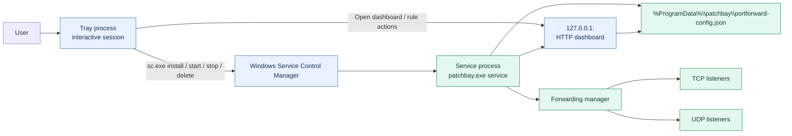
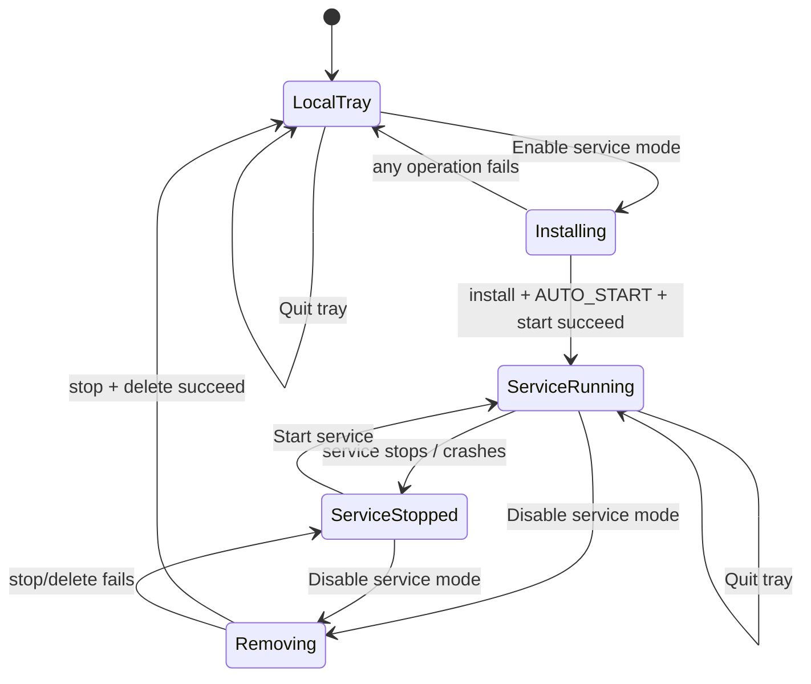

# Windows Service Mode Design

## Goal

Add an optional Windows Service mode. When enabled from the tray, the same executable is installed and started as an automatic Windows service. The service owns port forwarding and the dashboard after boot; the tray remains a user-session controller and dashboard launcher.

## Decisions

- Service mode uses the same executable with an internal `service` command.
- The Windows Service Control Manager starts the service automatically at boot.
- The service owns the forwarding manager and HTTP dashboard/API.
- The tray does not run a second forwarding manager while service mode is active.
- Tray-to-service control uses the existing localhost HTTP API without authentication, as explicitly accepted for this local/admin application.
- `Rule.Enabled` remains the persisted source of truth for each rule's desired runtime state.
- Service installation, removal, and start/stop operations use `sc.exe` directly from the elevated tray process. The existing `requireAdministrator` manifest supplies UAC elevation; no second helper process is needed.
- Service mode is Windows-only. Non-Windows builds retain the current development behavior.

## Runtime modes

### Local tray mode

The normal executable starts the config store, starts rules whose `Enabled` field is true, serves the dashboard on `127.0.0.1:<AdminPort>`, and creates the tray icon. This remains the fallback when service mode is not installed.

### Service mode

The executable is invoked by Service Control Manager with the `service` argument. It loads the shared config, starts enabled rules, serves the dashboard on the configured loopback port, and reports service stop through the Windows service callback. It does not create a tray icon or open a browser.

### Tray while service mode is active

The user-launched executable detects that the service is installed/running, avoids starting local forwarding and avoids binding the dashboard port, then creates the tray icon. `Open Dashboard` opens the service-owned dashboard. Rule changes go through the same localhost HTTP endpoints served by the service.

If the service is installed but stopped, the tray shows the service as stopped and offers `Start service`; it does not start a local forwarding copy. This prevents two owners from racing over config, firewall rules, or listen ports.

### Ownership diagram

The service is the only process that owns forwarding listeners and the dashboard while service mode is enabled. The tray controls SCM and sends normal rule actions to the service-owned HTTP API; it never starts a second listener set.

### Service mode state transitions

`Rule.Enabled` is independent of these service states: it determines which rules the service starts after boot, while SCM determines whether the service process itself is running.

## Service lifecycle menu

The tray menu contains:

- `Open Dashboard`
- `Start service` or `Stop service`, reflecting SCM state
- `Enable service mode` when not installed
- `Disable service mode` when installed
- `Quit`

Enabling service mode:

1. The already-elevated tray process installs the current executable as a uniquely named service, using the executable path plus `service` argument.
2. Set startup type to `AUTO_START`.
3. Start the service and wait for the SCM state to become running.
4. Keep the tray process as a UI-only client.

Disabling service mode:

1. Ask Windows for elevation if needed.
2. Stop the service and wait for it to stop.
3. Delete the service registration.
4. Return the existing tray process to local mode only after service removal succeeds. If removal fails, keep the tray in service-client mode and show the error.

`Quit` exits only the tray process when service mode is enabled; it must not stop the service. This is necessary for forwarding to survive logout/login and tray restarts.

## Configuration

The current relative config path is insufficient for a service because the executable may be installed under a protected directory. Introduce an explicit shared config path:

- Windows: `%ProgramData%\\patchbay\\portforward-config.json`
- Non-Windows development: retain the current executable-directory behavior.

Create the parent directory before first save. Existing configs next to the executable are migrated once on Windows when the ProgramData config does not exist: copy the old file, preserve its contents, and leave the original untouched as a rollback copy. Invalid or unreadable source config must fail loudly rather than overwrite the destination.

The config schema is unchanged. `Rule.Enabled` controls startup and is updated by the existing dashboard toggle endpoint. Service mode state is not stored in the rule model; it is owned by SCM.

## Process and HTTP boundaries

Refactor startup into reusable pieces:

- `loadRuntime()` creates the config store, manager, and HTTP app.
- `runForwardingRuntime()` starts enabled rules and serves HTTP until context cancellation.
- `runService()` wraps the runtime in the Windows service handler.
- `runTray()` owns only the user-session tray and callbacks.

The existing dashboard endpoints remain the single control surface for rules. No new unauthenticated privileged endpoint is needed for service management; service installation/control is performed by the elevated tray helper through SCM. The existing HTTP API remains bound to loopback only.

The service must stop cleanly: cancel runtime context, stop all managers/listeners/connections, remove firewall rules, and return from the service handler. The tray must not call `os.Exit` in a path that owns the service runtime.

## Windows implementation

Add Windows-only service-management code with a small internal abstraction for:

- Querying whether the service is installed and its SCM state.
- Installing/updating the service command and automatic start type.
- Starting and stopping with bounded waits.
- Deleting the service only after it is stopped.

Use `sc.exe` rather than adding a third-party service dependency. Quote the executable path correctly when passing it to `binPath`; append the `service` argument inside the quoted command line. All command failures must be surfaced to the tray as a concise error. Do not report success until the requested SCM state is observed.

The service name and display name are stable: `PatchbayPortForwarder` and `patchbay port forwarder`. The service description states that it owns the local patchbay dashboard and configured TCP/UDP forwarding rules.

## Error handling and state transitions

- Service install/start failure leaves the current mode unchanged and shows an error.
- Service stop timeout leaves the service registered and the tray in service-client mode.
- Service delete failure leaves the service registered and the tray in service-client mode.
- If a service is unexpectedly stopped, the tray displays stopped state and offers start; it does not silently fall back to local forwarding.
- If the service cannot bind the configured dashboard port, it logs the error and reports service failure; the tray shows the service as stopped.
- Rule start failures remain per-rule logs/warnings and must not prevent the service from managing other enabled rules.

## Verification requirements

Add deterministic tests for:

- Windows config path selection and migration decisions using injected filesystem paths where possible.
- Startup starts only rules with `Enabled == true`.
- Service stop cancels runtime and closes active forwarding connections.
- Tray mode selection never starts a local manager when SCM reports the service installed.
- Service command construction quotes paths with spaces and includes the `service` argument.

Run:

- `task test`
- `go test -race ./...`
- `task build-windows`

On a Windows host, manually verify:

1. Launching the binary shows the tray without a second dashboard port when service mode is active.
2. Enabling service mode prompts UAC, installs the service, starts it, and shows `Automatic` startup.
3. Rebooting starts forwarding from persisted `Rule.Enabled` values before user login.
4. Quitting the tray leaves the service and forwarding running.
5. Disabling service mode stops/removes the service and returns control to local tray mode.
