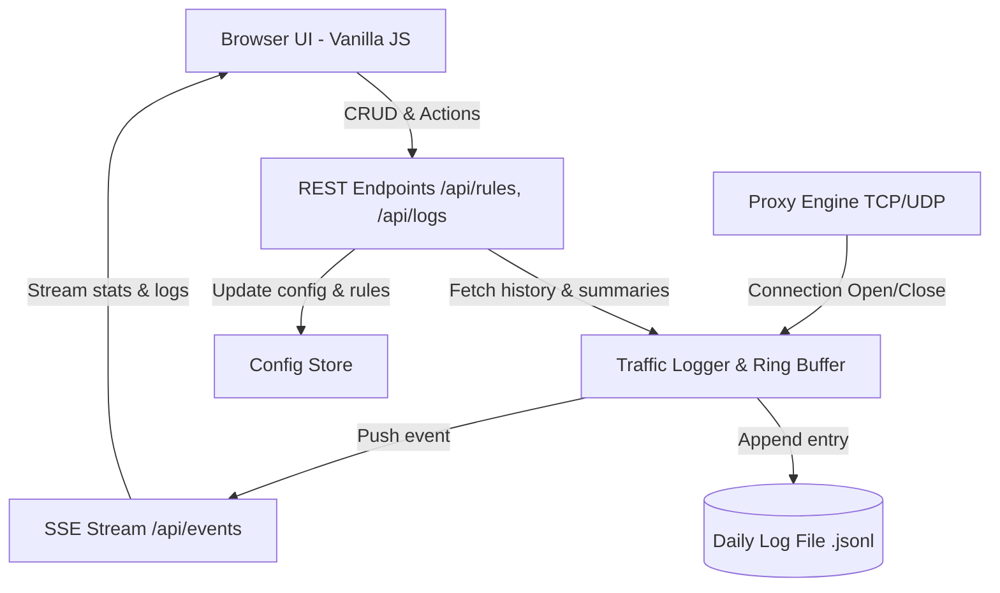

# Vanilla JS, SSE Realtime Dashboard, & Traffic Logging Design

## Goal

Replace the vendored HTMX library and polling-based UI with native Vanilla JS and Server-Sent Events (SSE). Add an integrated traffic logging subsystem with an in-memory ring buffer for live streaming, file-based persistence for historical traffic analysis, and native Canvas-based visual bandwidth/connection charts.

## Core Decisions

1. **Zero External Dependencies**:
   - Remove `web/static/htmx.min.js`.
   - Implement frontend exclusively in Vanilla JS (~3-4KB) without any third-party framework or charting library.
   - Implement SSE and REST APIs purely using Go standard library (`net/http`, `encoding/json`).
2. **Realtime Protocol (SSE)**:
   - Use Server-Sent Events (`GET /api/events`) for unidirectional server-to-browser push.
   - Built-in automatic reconnection handled by the browser `EventSource` API.
   - Stream live rule metrics (`stats` event) and individual connection lifecycle events (`log` event).
3. **Hybrid Traffic Logging**:
   - **In-Memory Ring Buffer**: Fixed capacity (default 1,000 entries) for immediate live feed and SSE push without disk I/O overhead.
   - **Persistent Storage**: Structured daily rotating JSON Lines files (`traffic-YYYY-MM-DD.jsonl`) in the shared config/log directory (`%ProgramData%\patchbay\logs\` on Windows, `./logs/` on other OSes).
   - **Concise Log Schema**: Captures timestamp, rule ID/name, protocol, client address, target address, bytes in, bytes out, duration in ms, and status (`active`, `closed`, `error`).
4. **Traffic Analytics & Canvas Charts**:
   - Backend calculates hourly/daily traffic summaries per rule (`GET /api/logs/summary`).
   - Frontend renders bandwidth and connection rate graphs via native HTML5 Canvas.

---

## Architecture & Data Flow

---

## API Specification

### Realtime Stream
- `GET /api/events`:
  - `Content-Type: text/event-stream`
  - Heartbeat / stats emitted every 1-2s.
  - Events:
    - `event: stats`: Full snapshot of live rule metrics (active connections, total connections, bytes in/out).
    - `event: log`: Individual connection event emitted on connection close or state change.

### REST Endpoints
- `GET /api/rules`: List all rules and live running state.
- `POST /api/rules`: Create a new rule.
- `PUT /api/rules/{id}`: Update an existing rule.
- `DELETE /api/rules/{id}`: Delete a rule.
- `POST /api/rules/{id}/toggle`: Toggle enable/running state of a rule.
- `GET /api/logs`: Fetch recent logs with query filters (`?rule_id=&limit=100&offset=0`).
- `GET /api/logs/summary`: Get aggregated bandwidth and connection volume grouped by hour/rule.
- `POST /api/logs/clear`: Clear in-memory ring buffer (and optionally truncate daily log files).

---

## Log Schema

Each traffic record contains:

| Field | Type | Description |
| :--- | :--- | :--- |
| `id` | `string` | Unique connection session ID |
| `time` | `string` (RFC3339) | Connection start timestamp |
| `rule_id` | `string` | Associated rule ID |
| `rule_name` | `string` | Human-readable rule name |
| `protocol` | `string` | `tcp` or `udp` |
| `client_addr` | `string` | Remote client `IP:port` |
| `target_addr` | `string` | Forwarded target `IP:port` |
| `bytes_in` | `int64` | Ingress bytes from client |
| `bytes_out` | `int64` | Egress bytes from target to client |
| `duration_ms` | `int64` | Active duration in milliseconds |
| `status` | `string` | `active`, `closed`, `error` |

---

## Frontend Components (Single File `app.js`)

1. **SSE Manager**:
   - Connects to `/api/events` on page load.
   - Dynamically updates rule table metrics without full DOM recreation.
   - Appends live rows to the live log inspector.
2. **Rule CRUD Controller**:
   - Form handling with validation using standard `FormData` and `fetch()`.
   - Modals or inline edit forms for adding and editing rules.
3. **Canvas Traffic Chart**:
   - Lightweight custom graph painter rendering bandwidth spikes and active connection curves onto an `<canvas>` element.
   - Interactive tooltips showing timestamp and throughput.
4. **Log Inspector**:
   - Live stream with pause/resume toggle.
   - Filter by rule or search by client IP.
   - Quick export to CSV/JSON.

---

## Verification & Testing Plan

1. **Automated Unit & Integration Tests**:
   - Test SSE connection handler and multi-subscriber broadcast.
   - Test in-memory ring buffer insertion, eviction, and filtering.
   - Test log persistence writer and daily rotation.
   - Test REST endpoints for rules and traffic log retrieval.
2. **Race Condition Checks**:
   - `go test -race ./...` under concurrent traffic loads.
3. **Windows & Platform Builds**:
   - `task test` and `task build-windows` to ensure zero dependency impact.
